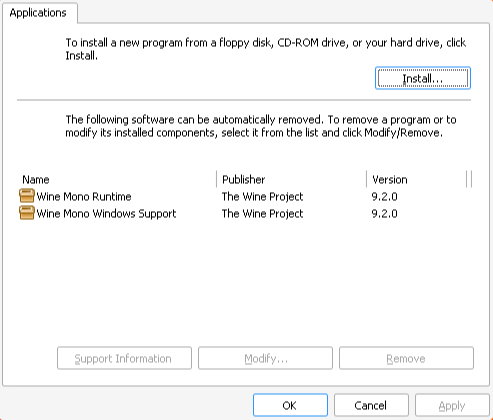

# How to Set Up Wine for Affinity using Rum

## Preface

> [!WARNING]
> Be advised that, if you purchased the old **V1 version** of your Affinity software(s) through the **Windows store**, you will **not** be able to activate your old licence on another OS.  
> The Windows Store just doesn't provide the product key you will need to enter after the installation, so, if you want to stay on Linux and not upgrade to V2 your only option is to user a virtual machine.  

This guide aims to provide a way to manage wine that does not make use of launchers like Lutris or Bottles.  
We will instead use `rum`, a small shell script that will help us manage multiple wine runners.

## Dependencies
Install the following programs (or your the equivalent for your distro) before proceding. 
- wget
- unzip
- git
- [winetricks](https://github.com/Winetricks/winetricks)

## Directories Setup

First, we'll create two directories in `~/.local/share/` which will help us organize our runners and prefixes without messing up our `$HOME`:

```bash
mkdir -p ~/.local/share/wine/runners
mkdir -p ~/.local/share/wine/prefixes
```

## Wine Runner Download

Then we'll download a build of ElementalWarrior's wine fork and `unzip` it.

```bash
pushd ~/.local/share/wine/runners &&
wget https://github.com/Twig6943/wine/releases/download/9.13/ElementalWarriorWine-x86_64.tar.gz &&
unzip ElementalWarriorWine-x86_64.tar.gz &&
rm ElementalWarriorWine-x86_64.tar.gz &&
popd
```

## `rum` Setup

Download `rum` into `/opt`

```
cd /opt/
sudo git clone https://gitlab.com/xkero/rum.git
```

Take ownership of the folder, replace your_username with your actual user.

```
sudo chown -R $(whoami) rum/
```

Create a symlink in `/usr/local/bin/`

```
ln -sf /opt/rum/rum /usr/local/bin/rum
```

We also need to make a small change in `rum` to adapt it the custom runners path we previously set up:

```bash
nano /usr/local/bin/rum
```

Change the `wines` variable to:

```
wines="$HOME/.local/share/wine/runners"
```

Now let's test if it's setup correctly.
Just run `rum` without argouments and check if it prints the following:

```plain
Not enough arguments!
Usage: rum <wine-version or /path/to/wine/version> </path/to/wine/prefix> <wine command> [wine arguments...]

Wine versions available:
ElementalWarriorWine-x86_64
```

Notice how `rum` correctly found our `ElementalWarriorWine`.

## Alias setup
We'll register an alias so that we don't need to always give `rum` the full path to the affinity wine prefix.
Open either you `.bashrc` or dedicated `.bash_aliases` file, and add the follwing alias:

```bash
alias wine-ew-affinity='rum ElementalWarriorWine-x86_64 $HOME/.local/share/wine/prefixes/affinity/'
```

I gave mine a pretty verbose name, but feel free to name it how you like.  
Also remember to `source` the file you just modified for the changes to take effect, e.g:
```bash
source .bash_aliases
```
Verify once again that your alias is setup correctly by calling it without argouments and checking that you see the same error as before.

## Wine Prefix configuration

### Initialization
We're now ready to actually set up the wine environent to run our Affinity installer in.

First, initialize the prefix:

```bash
wine-ew-affinity wine --init
```

### .NET Fix

Now, uninstall Wine Mono, wine's own .NET Framework replacement.  

> [!IMPORTANT]
> We'll need to remove Wine Mono because it comes preinstalled, but will conflict with and bork our own .NET Framework installation.  


```bash
wine-ew-affinity wine uninstaller
```
This window should open:


Click on `Wine Mono Runtime` and remove it.  
Both entries should now disappear and you should see an empty page.

### Winetricks

Now run winetricks with the following options to install all the needed dependecies in your Affinity prefix:

```bash
wine-ew-affinity winetricks --unattended --force vcrun2022 dotnet48 renderer=vulkan corefonts win11
```

> [!NOTE]
> This step will take a while and throw a bunch of warnings. This is expected so be patient and let it run.

### Getting WinMetadata

We'll now download some Windows system files and place them in the C drive of out prefix:

```bash
pushd ~/.local/share/wine/prefixes/affinity/drive_c/windows/system32/ &&
wget https://archive.org/download/win-metadata/WinMetadata.zip &&
unzip WinMetadata.zip &&
rm WinMetadata.zip &&
popd
```

## Installing Affinity Software
We're finally ready to actually run the installer.

> [!TIP]
> Official installers download links:
>
> |   |   |
> |---|---|
> |V2 (all)     |https://store.serif.com/en-us/account/licences/         |
> |Photo V1     | https://store.serif.com/it/update/windows/photo/1/     |
> |Designer V1  | https://store.serif.com/it/update/windows/designer/1/  |
> |Publisher V1 | https://store.serif.com/it/update/windows/publisher/1/ |


I'll use the installer for Affinity Photo V1 as an example.

```bash
wine-ew-affinity wine downloads/affinity-photo-1.10.6.exe
```


Click `Install`, and ignore all the warnings wine throws.  
Once it completes, close the installer.

Finally, launch the software!

```bash
wine-ew-affinity wine ~/.local/share/wine/prefixes/test/drive_c/Program\ Files/Affinity/Photo/Photo.exe
```


## Additional Tips & Tricks

### Fixing Scaling on HiDPI Screens

To adjust the scaling on high resolution monitors, run:

```bash
wine-ew-affinity winecfg
```
- Go on the `Graphics` tab
- Check `Emulate a virtual desktop`
- Adjust the `Desktop size`
- Uncheck `Emulate a virtual desktop`
- Increase the `dpi`

> [!NOTE]
> As I understood it, the `dpi` value is a percentage applied to the currently set `Desktop Size`.  
> So, for a 4k monitor, setting the the desktop size to `1920 x 1080` and scaling it by 200% works quite well.


## Credits
Thanks to:
- [ElementalWarrior](https://gitlab.winehq.org/ElementalWarrior) for his wine fork
- [Twig6943](https://github.com/Twig6943) for building the wine binary
- [xkero](https://gitlab.com/xkero) for his [rum script](https://gitlab.com/xkero/rum)
- [foinf](https://github.com/foinf) for [finding a fix](https://github.com/bottlesdevs/Bottles/issues/2887#issuecomment-2646118028) for the broken .NET install
- [wanesty](https://codeberg.org/wanesty) for the original [rum guide](https://affinity.liz.pet/docs/1-intro.html)