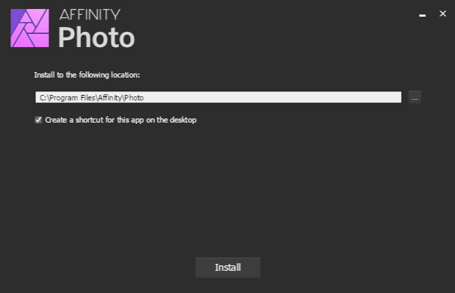
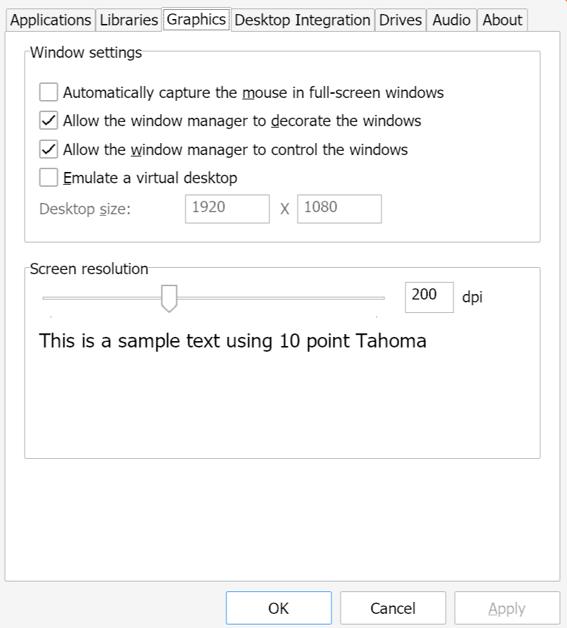

# Set Up Wine for Affinity Apps Using Rum

## Preface

This guide aims to provide a way to manage wine that does not make use of launchers like Lutris or Bottles.  
We will instead use `rum`, a small shell script that will help us manage multiple wine runners.

## Dependencies
Install the following programs (or the equivalent for your distro) before proceeding. 
- wget
- unzip
- git
- [winetricks](https://github.com/Winetricks/winetricks)

### Debian-based distros:
```bash
sudo apt update && sudo apt install wget unzip git winetricks
```

### Arch-based distros:
```bash
sudo pacman -Sy wget unzip git winetricks
```

### Fedora-based distros:
```bash
sudo dnf install wget unzip git winetricks
```

## Directories Setup

First, we'll create two directories in `~/.local/share/` which will help us organize our runners and prefixes without messing up our `$HOME`:

```bash
mkdir -p ~/.local/share/wine/runners
mkdir -p ~/.local/share/wine/prefixes
```

## Wine Runner Download

First, check which `glibc` version your system is running:

```bash
getconf GNU_LIBC_VERSION
```

If you're running a version lower than `glibc 2.39`, like distros based on `Ubuntu 22.04` do, download [Bugg4](https://github.com/Bugg4/wine/releases)'s build, which was linked against `glibc 2.35`:

```bash
wget -O ~/.local/share/wine/runners/ElementalWarriorWine-x86_64-Glibc-2.35.tar.gz https://github.com/Bugg4/wine/releases/download/9.13/ElementalWarriorWine-x86_64-Glibc-2.35.tar.gz
```

Else, download [Twig6943](https://github.com/Twig6943/wine/releases)'s build:

```wget
wget -O ~/.local/share/wine/runners/ElementalWarriorWine-x86_64.tar.gz https://github.com/Twig6943/wine/releases/download/9.13/ElementalWarriorWine-x86_64.tar.gz
```

> [!NOTE]
> You can check [Twig6943's GitHub releases](https://github.com/Twig6943/wine/releases) page for newer builds of ElementalWarrior's wine fork.

Now extract it:

```bash
pushd ~/.local/share/wine/runners &&
tar xvzf ElementalWarriorWine-x86_64*.tar.gz &&
rm ElementalWarriorWine-x86_64*.tar.gz &&
popd
```

## `rum` Setup

Download `rum` into `/opt`

```
cd /opt/
sudo git clone https://gitlab.com/xkero/rum.git
```

Let the current user you're logged in as take ownership of the folder.

```
sudo chown -R $USER:$USER rum/
```

Create a symlink in `/usr/local/bin/`

```
sudo ln -sf /opt/rum/rum /usr/local/bin/rum
```

We also need to make a small change in `rum` to adapt it the custom runners path we previously set up:

```bash
nano /opt/rum/rum
```

Change the `wines` variable to:

```
wines="$HOME/.local/share/wine/runners"
```

Now let's test if it's setup correctly.
Just run `rum` without arguments and check if it prints the following:

```plain
Not enough arguments!
Usage: rum <wine-version or /path/to/wine/version> </path/to/wine/prefix> <wine command> [wine arguments...]

Wine versions available:
ElementalWarriorWine-x86_64
```

Notice how `rum` correctly found our `ElementalWarriorWine`.

## Alias Setup
We'll register an alias so that we don't need to always give `rum` the full path to the Affinity Wine prefix.  

> [!NOTE] 
> If you're using a shell different from `bash` make sure to register the alias in the appropriate config file.

Open either your `.bashrc` or dedicated `.bash_aliases` file, and add the following alias:

```bash
alias wine-ew-affinity='rum ElementalWarriorWine-x86_64 $HOME/.local/share/wine/prefixes/affinity/'
```

I gave mine a pretty verbose name, but feel free to name it how you like.  
Also remember to `source` the file you just modified for the changes to take effect:
```bash
source ~/.bash_aliases
```
Verify once again that your alias is setup correctly by calling it without arguments and checking that you see the same error as before.


## Wine Prefix Configuration

### Initialization
We're now ready to actually set up the wine environment to run our Affinity installer in.

First, initialize the prefix:

```bash
wine-ew-affinity wineboot --init
```

### Winetricks

> [!IMPORTANT]
> We use the `remove_mono` verb becase the .NET version we're installing would directly conflict with it, as stated in the [Wine Mono README](https://github.com/wine-mono/wine-mono?tab=readme-ov-file#composition:~:text=Wine%20Mono%20should%20always%20be%20removed%20before%20installing%20.NET%20Framework%204.8%20and%20earlier%2C%20it%20can%20coexist%20with%20.NET%20Core%20and%20.NET%205%20or%20later.)

Now run winetricks with the following options to install all the needed dependencies in your Affinity prefix:

```bash
wine-ew-affinity winetricks --unattended remove_mono vcrun2022 dotnet48  corefonts win11
```

> [!NOTE]
> We set the renderer to vulkan in a separate step, after all the previews winetricks have been applied.


```bash
wine-ew-affinity winetricks renderer=vulkan
```

> [!NOTE]
> This step will take a while and throw a bunch of warnings. This is expected so be patient and let it run.

### Getting WinMetadata

We'll now download some Windows system files and place them in the C drive of our prefix:

```bash
pushd ~/.local/share/wine/prefixes/affinity/drive_c/windows/system32/ &&
wget https://archive.org/download/win-metadata/WinMetadata.zip &&
unzip WinMetadata.zip &&
rm WinMetadata.zip &&
popd
```

## Installing Affinity Software
We're finally ready to actually run the installer.

> [!TIP]
> Official installers download links:
>
> | Program | URL |
> |---------|-----|
> |V2 (all)     |https://store.serif.com/en-us/account/licences/         |
> |Photo V1     | https://store.serif.com/it/update/windows/photo/1/     |
> |Designer V1  | https://store.serif.com/it/update/windows/designer/1/  |
> |Publisher V1 | https://store.serif.com/it/update/windows/publisher/1/ |


I'll use the installer for Affinity Photo V1 as an example.

```bash
wine-ew-affinity wine ~/Downloads/affinity-photo-1.10.6.exe
```



Click `Install`, and ignore all the warnings Wine throws.  
Once it completes, close the installer.

Finally, launch the software!

```bash
wine-ew-affinity wine ~/.local/share/wine/prefixes/test/drive_c/Program\ Files/Affinity/Photo/Photo.exe
```


## Additional Tips & Tricks

### Fixing Scaling on HiDPI Screens

To adjust the scaling on high resolution monitors, run:

```bash
wine-ew-affinity winecfg
```
Go on the `Graphics` tab and increase the `dpi` to your preference.



## Creating a `.desktop` Launcher
Create a .desktop launcher by following this [Desktop Launcher Guide](https://github.com/seapear/AffinityOnLinux/blob/main/Guides/Rum/Guide-DesktopLauncher.md) so you can open affinity from your desktop.

## Credits
Thanks to:
- [ElementalWarrior](https://gitlab.winehq.org/ElementalWarrior) for his wine fork
- [Twig6943](https://github.com/Twig6943) for building the wine binary
- [xkero](https://gitlab.com/xkero) for his [rum script](https://gitlab.com/xkero/rum)
- [foinf](https://github.com/foinf) for [finding a fix](https://github.com/bottlesdevs/Bottles/issues/2887#issuecomment-2646118028) for the broken .NET install
- [wanesty](https://codeberg.org/wanesty) for the original [rum guide](https://affinity.liz.pet/docs/1-intro.html)
